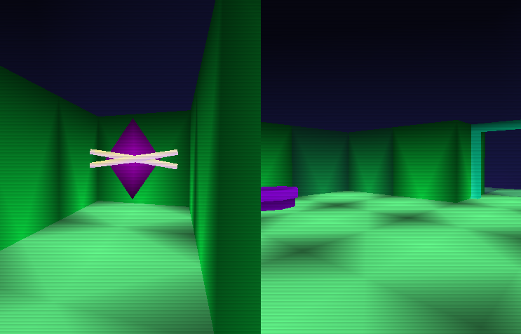

# GemQuest

## Description

This project was my submission to an university assignment with rather specific limitations: program a simple maze game in C/C++, but with no libraries besides freeglut/glew, and everything needs to be inside one file. The task was tailored to be programmed using immediate mode OpenGL (as learned in the lecture) and was allowed to be "ugly" - but as this was not stringent, I used modern OpenGL, the power of shaders, embedded the meshes into the source code (using an attached Python exporter script for Blender) and came up with probably the most boring game you'd ever play.

_But at least it's pretty._

## How to run

Download and extract the current release and run the contained executable - if the program doesn't start, make sure you have the recent Visual C++ redistributable installed.

## How to build

As the whole "project" only consists of one C file, the building process is pretty simple - the easiest way is to just run the provided Visual Studio 2019 project, the required dependencies are included as NuGet packages. It can also be compiled using g++ under Linux with the following command (assuming you're in the project directory and have the required development packages for the libraries installed): ``g++ main.c -o GemHunter -lGL -lGLU -lglut -lGLEW``

